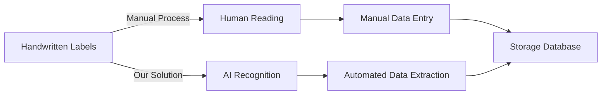
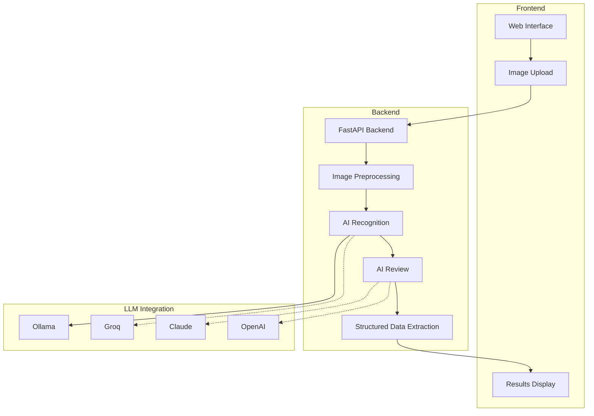
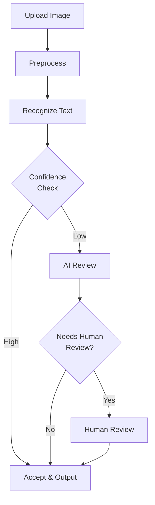

# Handwritten Label AI Assistant Demo

## Slide 1: Introduction & Problem

**Handwritten Label AI Assistant**

- Transforming handwritten label management with AI
- Processes handwritten labels on storage containers and documents
- Extracts text and structured data with high accuracy

**Key Problem We're Solving:**
- Manual processing of handwritten labels is:
  - Time-consuming
  - Error-prone
  - Resource-intensive

---

## Slide 2: System Architecture

**How It Works:**

- Modern React frontend with responsive UI
- FastAPI Python backend
- Modular architecture with multiple LLM provider support
- Local processing with Ollama + cloud options (Groq, Claude, OpenAI)

---

## Slide 3: Key Features & Capabilities

**Core Capabilities:**

1. **Image Processing & Enhancement**
   - Contrast enhancement
   - Noise reduction
   - Automatic resizing
   - Format conversion

2. **AI-Powered Recognition**
   - Multimodal LLM for handling various label formats
   - Context-aware interpretation
   - Structured data extraction

3. **Quality Assurance**
   - Confidence scoring
   - Automated review
   - Human verification for low-confidence results

4. **Workflow Integration**
   - Recognition history tracking
   - Corrected data storage for model improvement
   - API for system integration

---

## Slide 4: Live Demo

**Demo Walkthrough:**

1. **Upload a handwritten label image**
   - Observe preprocessing options
   - Image enhancement in action

2. **Process with AI**
   - Watch the recognition process
   - See confidence scores

3. **Review & Correct**
   - Examine structured data extraction
   - Make corrections (if needed)

4. **View History**
   - Check recognition history
   - Compare results

**Key Points to Observe:**
- Accuracy of text extraction
- Structured data organization
- UI responsiveness and user-friendliness

---

## Slide 5: Benefits & Next Steps

**Next Steps:**
1. Integration with existing inventory management systems
2. Multi-language support expansion
3. Mobile app development
4. Advanced analytics & reporting
5. Continuous model improvement

**Start Using Today:**
- Quick setup with local processing
- Scalable to enterprise needs
- Supports various label formats